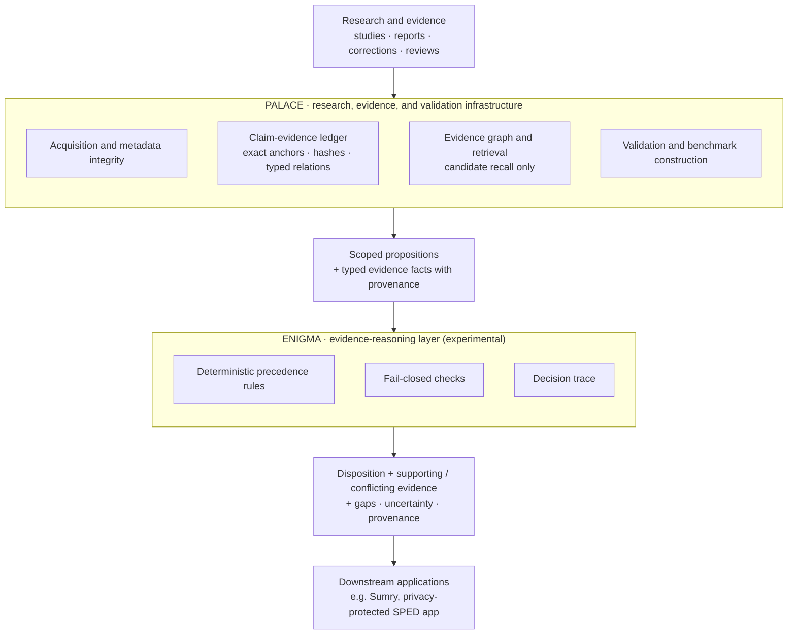

# Enigma

**Evidence reasoning you can audit. Enigma works out what a body of evidence supports, shows why, and says so plainly when the evidence can't settle the question.**

> [!NOTE]
> Research-stage project. This repository documents the design, the evidence states, the experimental record, and a synthetic worked example. It does not contain a released implementation yet. The reasoning layer has been through two bounded experiments, one synthetic and one on real research material. It has **not** yet been shown to add value over simpler approaches. That comparison (E5) is planned, and no E5 results exist. See [Current status](#current-status).

---

Eight reports on one reading intervention. Most of them say it works. One randomized study says it doesn't. Two of the positive reports describe the same four children. The strongest positive group studies enrolled students with learning disabilities, but the question is about students with intellectual disability. A comprehension result that looked promising was corrected two years later. One "improved reading" finding turns out to be a teacher survey of engagement. Nobody measured whether the gains last.

A summary, human or generated, usually flattens that into one paragraph. Enigma, given explicit facts about each piece of evidence, returns something else: one decision per scoped question, each tied to the evidence and the rule that produced it.

| Question (scoped) | Enigma's result | Why |
| --- | --- | --- |
| Fluency, students with mild ID | **Contradictory evidence** | Two independent studies in this population disagree. Both are kept. |
| Comprehension, students with mild ID | **Missing evidence** | The positive result was corrected. What remains is too imprecise to show an effect *or* rule one out. |
| Gains maintained after support ends | **Missing evidence** | The corpus was checked. No study measured it. |
| Fluency, students with learning disability | **Supported** | Two independent direct studies agree. Doesn't transfer to the ID question. |
| Fluency, students who use AAC | **Unexplored** | Registered as relevant. Nobody has searched yet. |

That table is the synthetic example in [`examples/`](examples/). All studies in it are invented.

## The problem

Evidence synthesis breaks in predictable places:

- **Conflict** gets averaged away, or resolved by whichever study is newest.
- **Insufficient evidence** gets reported as "no effect."
- **Population mismatch.** A finding from one group gets applied to another.
- **Construct mismatch.** "Reading engagement" gets counted as "reading fluency" because the abstract said "improved reading."
- **Duplicate reports** of one sample get counted as replication.
- **Superseded results** stay in circulation after a correction or retraction, or older evidence gets dropped just because something newer exists.
- **Gaps** stay invisible: nobody records the questions no one has investigated.

Retrieval-augmented generation fixes one problem, which is getting relevant text in front of a model. It does little for these. The model still decides, in prose, with no record of which rule it applied.

## What Enigma does

Enigma takes a scoped proposition (*subject, predicate, object, population, setting, time*) and explicit facts about the evidence bearing on it. It then applies a fixed, ordered set of rules and returns:

- a **disposition**, one of six defined evidence states;
- the **supporting, contradicting, and qualifying evidence**, with source locators;
- **historical evidence** that was superseded, kept in the record rather than deleted;
- typed **uncertainty** and the specific **missing evidence**;
- a **precedence trace** showing which rule fired and why;
- **provenance**: where each fact came from, what process produced the result, and whether any model or outside knowledge was involved.

When a required fact is missing, Enigma refuses to guess. It returns an explicit "not assessable" outcome instead of a disposition.

## How it differs from summarization and RAG

| | LLM summary / RAG | Enigma |
| --- | --- | --- |
| Unit of output | Paragraph | One disposition per scoped proposition |
| Conflict | Often blended into a hedge | First-class state; both sides preserved |
| "No significant effect" | Often read as "doesn't work" | Not a negative finding unless an adequacy criterion is met |
| Newer study | Tends to win implicitly | Replaces older evidence only through an explicit correction, retraction, or replacement |
| Population / measure differences | Easy to blur | Recorded as qualifications, not counted as support or conflict |
| Nothing found | Silence, or a guess | `MISSING_EVIDENCE` (looked, not enough) vs. `UNEXPLORED` (not looked yet) |
| Why this answer? | Re-prompt and hope | Deterministic trace from rule to evidence to source locator |
| Model knowledge | Mixed in invisibly | Labeled as external; never used to fill a gap in the evidence |

## Architecture

Enigma sits on top of **Palace**, the research, evidence, provenance, and validation infrastructure, which also builds the benchmarks and runs the evaluations. Palace gets evidence into a state where it can be reasoned about: sourced, anchored, hashed, versioned, and checked. Enigma is the reusable reasoning layer over that evidence, and its added value is still to be demonstrated. Applications consume the result.



The split is deliberate. Palace decides *what the record says and where it came from*. Enigma decides *what that record allows you to conclude*. Neither is allowed to do the other's job, so a retrieval score can't become evidence and a reasoning shortcut can't quietly rewrite the record. A planned loop sends gaps Enigma finds (missing or unexplored evidence) back to Palace as proposed new inquiries, never as direct edits. Details in [docs/architecture.md](docs/architecture.md).

### Evidence states

| State | Meaning |
| --- | --- |
| `SUPPORTED_RELATIONSHIP` | Adequate, direct evidence supports the proposition in this scope, with nothing current against it. |
| `NO_RELATIONSHIP` | Adequate evidence affirmatively shows the relationship does not hold. Stronger than "nothing found." |
| `CONTRADICTORY_EVIDENCE` | Independent evidence supports incompatible outcomes for the same scope. |
| `MISSING_EVIDENCE` | The question was investigated. The evidence doesn't meet a declared adequacy criterion. |
| `UNKNOWN_RELATIONSHIP` | Investigated, but nothing more specific can be justified. |
| `UNEXPLORED_RELATIONSHIP` | Identified as relevant. No qualifying investigation yet. |

These are kept computationally distinct. None of them can be produced by a missing edge, a null field, a low score, or a default. Operational failures (malformed record, stale input, not assessable) sit on a separate axis and are never reported as evidence states.

## Current validation domain

Enigma is being tested on **special-education research**. It's a hard environment for evidence reasoning, and on purpose: small samples, single-case designs, heterogeneous populations, outcome measures that sound alike but aren't, and practical decisions that depend on getting population fit right.

The architecture itself is domain-neutral. Nothing in the evidence states or rules is specific to special education.

## Current status

Status as of September 2026. Full detail in [docs/current-status.md](docs/current-status.md).

Four labels are used throughout:

- **Implemented**: code exists.
- **Tested**: automated tests or a frozen experiment exercise it.
- **Experimental**: exists only as experiment code under a frozen protocol, not as a library or service.
- **Planned**: intended. It may have a written design, but no code.

| Component | State |
| --- | --- |
| Palace: claim-evidence ledger, metadata integrity checks, evidence graph, retrieval with line-level attribution | **Implemented, Tested** (private research repository) |
| Palace: literature-acquisition pipeline | **Implemented, Tested**; awaiting a second independent review |
| Evidence states, provenance axes, invariants | **Planned** as a runtime; the semantics are fixed in a frozen design document |
| Enigma deterministic reasoning layer | **Experimental**; tested in E3 (synthetic) and E4 (real material) |
| Automatic extraction of the typed facts from real literature | **Experimental, not working yet**. See E4 below |
| E5: comparison of simpler approaches against Enigma | **Planned.** No E5 results exist |
| Significance ranking of gaps, user interface | **Planned** |

**Experimental record, briefly:**

- **E2. Standalone Enigma: stopped, then repositioned.** An earlier design ran Enigma as a standalone classifier with a larger state vocabulary. It showed no advantage over a frontier language model given the same evidence and provenance, and the decisive facts lived in free text where no honest deterministic resolver could reach them. That design was stopped. Enigma was not dropped. It was narrowed into a bounded reasoning layer that sits on Palace's evidence infrastructure, and that layer has to prove its worth.
- **E3. Representation feasibility: passed, narrowly.** On 12 synthetic, hand-built probes, the deterministic layer returned the expected state in 12/12 cases versus 5/12 for a baseline without typed facts, with a complete audit trace for every decision. This shows the representation is *sufficient*. It says nothing yet about real-world accuracy.
- **E4. Real-corpus derivability: gap confirmed.** On real special-education research notes, the deterministic extractor could not derive the key facts (investigation status, adequacy, conflict) for any of the 12 admitted propositions, and correctly abstained every time: zero fabricated dispositions. A human reader recovered many of those facts from the same material. That gap is the current bottleneck. It also means a stronger controlled comparison is needed before anyone can say whether Enigma adds value.
- **E5. Planned decision gate.** The next evaluation is planned to compare simpler approaches against the Enigma reasoning approach. If the simpler approaches do as well, Enigma hasn't earned its place as a separate layer, and that is the result that gets reported. E5 has not been run. No E5 results exist.

## Principles

1. **Traceable or it doesn't count.** Every conclusion resolves to evidence, a source locator, and the rule that used it.
2. **Fail closed.** Missing inputs produce an explicit refusal, never a plausible guess.
3. **Absence is information, and it comes in kinds.** Not investigated, investigated and insufficient, and affirmatively negative are different findings.
4. **Disagreement is preserved.** Conflict is not resolved by majority, recency, or confidence.
5. **Scope qualifies every claim.** Population, measure, setting, and time are part of the proposition.
6. **Models propose; evidence decides.** Model output stays labeled as model output. External model knowledge never fills a gap in the evidence.
7. **Prove it against something simpler.** A layer that can't beat a cheaper alternative given the same information shouldn't exist.

## Roadmap

Ordered, not dated. Each step depends on the result of the one before it.

- [x] Evidence infrastructure: ledger, integrity checks, graph, retrieval (Palace)
- [x] Evidence-state and provenance contract (frozen design document; runtime planned)
- [x] E3: synthetic representation feasibility
- [x] E4: real-corpus derivability and fail-closed behavior
- [ ] **E5: controlled comparison of simpler approaches against Enigma** ← decision gate (planned; no results yet)
- [ ] Depending on E5: reproducible fact encoding on real literature (human-first, model-assisted only as labeled proposals)
- [ ] Depending on E5: a public reference implementation of the reasoning layer
- [ ] Gap significance ("which unknowns matter most"), explainable rather than a single score
- [ ] Interfaces for downstream applications
- [ ] Validation in a second domain outside special education

If E5 shows no added value from Enigma, the roadmap changes. The evidence-state vocabulary and provenance model can still stand on their own.

## Repository layout

```
.
├── README.md                    this page
├── docs/
│   ├── architecture.md          Palace, Enigma, evidence flow, states, rules, provenance
│   ├── methodology.md           how experiments are designed, frozen, and reviewed
│   └── current-status.md        what exists, what's been tested, what hasn't
├── examples/
│   ├── README.md                how to read the example
│   ├── example_input.json       synthetic evidence set (invented studies)
│   └── example_output.json      Enigma-style result for that input
└── CONTRIBUTING.md
```

## Relationship to other projects

- **Palace** is the research, evidence, provenance, and validation infrastructure underneath Enigma. It is described here but developed in a private research repository alongside the experiments.
- **Sumry** is a separate, privacy-protected special-education (SPED) application that may use Enigma later. No student data comes into this repository, and this repository is not about Sumry.

## License

No license has been chosen yet. Until one is added, default copyright applies and no reuse rights are granted. This is an open decision, not an oversight.

## Contributing

Feedback on the evidence states, the rules, and the experimental design is welcome. See [CONTRIBUTING.md](CONTRIBUTING.md).
