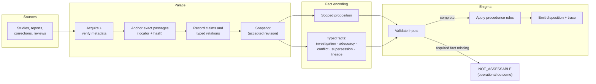
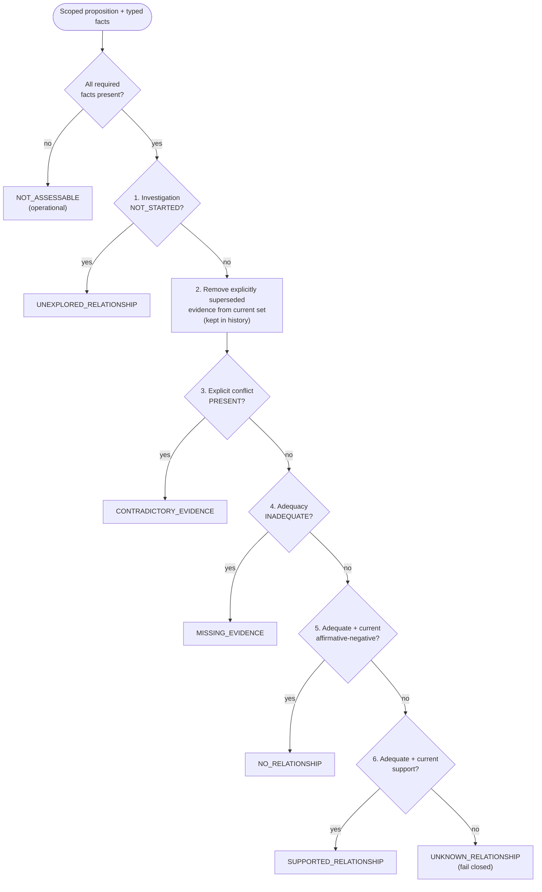

# Architecture

This page covers how Palace and Enigma divide the work, what flows between them, how evidence states are decided, and where models are and aren't allowed. Everything is labeled by status, because much of it is a design contract rather than running code.

| Label | Meaning here |
| --- | --- |
| **Implemented** | Code exists and has automated tests (in the private research repository) |
| **Experimental** | Exists as experiment code under a frozen protocol; not a library or service |
| **Specified** | Defined in a frozen design contract; no runtime yet |
| **Planned** | Intended; design not frozen |

## Contents

1. [Why two layers](#1-why-two-layers)
2. [Palace](#2-palace)
3. [Evidence flow](#3-evidence-flow)
4. [Provenance](#4-provenance)
5. [Enigma's input: scoped propositions and typed facts](#5-enigmas-input-scoped-propositions-and-typed-facts)
6. [Evidence states](#6-evidence-states)
7. [The precedence rules](#7-the-precedence-rules)
8. [Common evidence problems and how they're represented](#8-common-evidence-problems-and-how-theyre-represented)
9. [Deterministic and model-assisted components](#9-deterministic-and-model-assisted-components)
10. [Validation philosophy](#10-validation-philosophy)
11. [Open questions](#11-open-questions)

---

## 1. Why two layers

A retrieval index knows which passages look similar to a query. A citation graph knows which papers point at which. Neither knows whether a finding applies to the population in question, whether a correction replaced it, or whether anyone has looked for counterevidence. Systems that let infrastructure signals stand in for those judgments end up treating a missing edge as "no relationship" and high similarity as "support".

So the work is split:

- **Palace** owns the record: what sources exist, the exact passages used, how they're identified and hashed, which claims they bear on, what changed and when. It can say *what the record says and where it came from*. It never decides what the record means.
- **Enigma** owns the judgment: given a scoped proposition and explicit facts about the evidence, which evidence state follows, and why. It reads Palace's output. It can't write to the canonical record.

The boundary goes one way. Enigma's output is derivative: rebuildable from the canonical record plus its rules, and disposable. If an Enigma result should change the record (a new question worth tracking, a gap to investigate), that goes back as a *proposal* through a reviewed path, never as a direct write.

The name comes from the part of the problem that motivated the project. An *enigma* is what the evidence can't settle: conflict it can't reconcile, a question nobody has studied, a claim resting on an assumption. Reporting those honestly is harder than reporting what's known, and it matters as much.

## 2. Palace

Palace is the evidence and validation layer. Most of it predates the Enigma experiments.

| Component | What it does | Status |
| --- | --- | --- |
| Canonical record | Plain-text (Markdown) notes under version control. An accepted revision is the authoritative record. Everything else is derived from it. | Implemented |
| Claim-evidence ledger | Structured records for sources, exact evidence anchors, claims, typed relations (`supports`, `contradicts`, `qualifies`, `supersedes`, and others), and artifacts that use them. Anchors carry text hashes so an excerpt can be checked against its source. | Implemented, tested |
| Metadata integrity | Checks bibliographic metadata (e.g. DOI, authors, year) against an external registry. Report-only: it flags mismatches, it doesn't rewrite. It checks *identity*, not evidence quality. | Implemented, tested |
| Literature acquisition | Turns a bibliography into a verified, deduplicated corpus with provenance records. Retrieves full text only through legal open-access routes. | Implemented; second independent review pending |
| Evidence graph | Deterministic, disposable graph built only from explicit links and ledger relations. | Implemented, tested |
| Retrieval | Section-aware semantic search that returns passages with exact note/section/line attribution. Used for candidate recall only. Similarity is never treated as evidence. | Implemented, tested |
| Derivative rebuild | Indexes, review queues, and graph/retrieval stores can be deleted and rebuilt from the canonical record. | Implemented, tested |
| Evidence-state and provenance contract | The semantics in sections 4–7 below: six states, orthogonal provenance axes, fail-closed behavior, 24 architectural invariants. | Specified |
| Benchmark and experiment harness | Frozen protocols, deterministic runners, byte-identical re-run checks. | Implemented for E3/E4 |

What Palace deliberately does **not** do: infer that two things are unrelated because no edge connects them, treat a `[!gap]`-style human annotation as a finding, or merge two records because their titles look alike.

## 3. Evidence flow



The middle box is the hard part and the current bottleneck. In the E3 experiment the typed facts were written by hand. E4 tested whether they could be derived automatically from real research notes, and mostly they couldn't (see [current-status.md](current-status.md)). Today, fact encoding is a human task.

## 4. Provenance

Provenance isn't one field. The contract treats it as independent axes that must not be collapsed into a single label or score:

| Axis | Examples |
| --- | --- |
| Locator | source ID, passage locator, content hash, snapshot revision |
| Origin actor | source author, human user, deterministic system, model, unknown |
| Epistemic basis | direct source report, exact evidence, user interpretation, cross-source synthesis, deterministic derivation, model inference, unknown |
| Support path | the evidence and intermediate assertions used, including counterevidence |
| Process | rule set / tool / model and version, parameters |
| Externality | corpus-only, external evidence admitted, external model knowledge, mixed |
| Workflow state | observed, proposed, accepted, rejected, superseded, invalidated |
| Review | who reviewed, what they decided, when; or explicitly unreviewed |
| Uncertainty and coverage | typed uncertainty, what was searched, what was excluded |

Two rules follow. First, if a person accepts a model's proposal, the record keeps *both*: the model origin and the human decision. Acceptance never rewrites the origin. Second, model knowledge from outside the corpus stays labeled as external and can't fill a gap. The system is allowed to say "your evidence can't answer this; here is something outside it that might." It is not allowed to fold that into the answer.

## 5. Enigma's input: scoped propositions and typed facts

Enigma never evaluates "is X related to Y" in the abstract. The unit is a **scoped proposition**:

```
subject + predicate + object + scope (population, setting, measure, …) + time bounds
```

evaluated against a **declared corpus snapshot** and **declared coverage**. A missing scope qualifier means "not determined". It does not mean "applies to everyone."

For each proposition, Enigma needs seven typed facts. This set was fixed in the E3 experiment:

| Fact | Values | Why it's needed |
| --- | --- | --- |
| Typed provenance | origin and basis per evidence item | Distinguish source reports from interpretation and inference |
| Evidence lineage | study ID, report ID, derived-from | Two reports of one sample aren't two studies |
| Investigation status | `NOT_STARTED` · `PARTIAL` · `COMPLETE` | Separates "not looked" from "looked, found little" |
| Evidence adequacy | `ADEQUATE` · `INADEQUATE` · `UNASSESSED`, plus the criterion and rationale | Makes "enough evidence" an explicit, inspectable judgment |
| Explicit conflict | `PRESENT` · `ABSENT` · `UNASSESSED`, with the evidence IDs involved | Conflict is recorded, not inferred from a negative number |
| Explicit supersession | `CORRECTED` · `RETRACTED` · `INVALIDATED` · `REPLACED`, linking prior to replacement | Only an explicit relation removes evidence from the current judgment |
| Precedence trace | produced by Enigma | Shows which rule decided |

Each evidence item carries a relation to the proposition: `SUPPORTS`, `AFFIRMATIVE_NEGATIVE` (evidence that the relationship does *not* hold, which is different from absence of support), or `QUALIFIES` (bears on the question but is indirect, mismatched, or imprecise).

See [`examples/example_input.json`](../examples/example_input.json) for a complete synthetic instance.

## 6. Evidence states

### Dispositions

Exactly one per assessed proposition:

| Disposition | Requires |
| --- | --- |
| `SUPPORTED_RELATIONSHIP` | Investigation done; adequacy met; current supporting evidence; no current conflict |
| `NO_RELATIONSHIP` | Investigation done; adequacy met; current affirmative-negative evidence. "No significant effect" or "nothing found" does not qualify on its own |
| `CONTRADICTORY_EVIDENCE` | Independent evidence paths supporting incompatible outcomes for the same scope, after scope differences are accounted for |
| `MISSING_EVIDENCE` | An explicit evidence obligation that the examined corpus doesn't meet. It does not claim the evidence doesn't exist anywhere |
| `UNKNOWN_RELATIONSHIP` | Investigation happened; nothing more specific can be justified. The fail-closed endpoint for assessed cases |
| `UNEXPLORED_RELATIONSHIP` | A recorded reason the question matters, and a record that no qualifying investigation has happened |

None of these may be represented by `null`, `false`, `0`, a missing row, a missing edge, or a low score.

### Operational outcomes (a separate axis)

| Outcome | Meaning |
| --- | --- |
| `NOT_ASSESSABLE` | A fact the rules need is missing or underivable. No disposition is emitted |
| `MALFORMED_RECORD` | Input fails validation |
| `STALE` | The result was computed from a snapshot that has since changed |

These describe the system, not the world. "The extractor couldn't read the investigation status" must never surface as "this relationship is unknown."

### Typed uncertainty

Uncertainty is recorded by kind rather than as a scalar: epistemic unknown, insufficient evidence, conflicting evidence, low-confidence inference, unexamined area, user-declared uncertainty, system uncertainty. A claim can be high-confidence and contested at the same time. System uncertainty (parse failures, retrieval problems) is never presented as a finding about the evidence.

### Transitions

A new assessment never overwrites an old one. Each transition records the trigger, the evidence or coverage that changed, who or what acted, and when. `UNEXPLORED → MISSING_EVIDENCE` after a search comes up short. `SUPPORTED → CONTRADICTORY` when compatible counterevidence appears, with the earlier support still visible. Returning to `UNEXPLORED` for the same proposition is normally invalid, because exploration history exists. *(Specified; transition history is not implemented.)*

## 7. The precedence rules

Status: **Experimental.** Implemented as experiment code in E3 and E4.

The rules are applied in a fixed order. The first rule that matches decides.



Some consequences of the ordering:

- **Conflict is checked before adequacy.** Two small, disagreeing studies are a conflict, not "insufficient evidence." The disagreement is itself the finding.
- **Supersession runs before conflict.** A correction that replaces an earlier analysis removes the old path, so a study doesn't "conflict" with its own correction.
- **Recency is not a rule.** A newer study with the opposite result is a conflict unless there's an explicit correction, retraction, or replacement.
- **Nothing else votes.** Source count, publication year, confidence scores, sample size on its own, graph connectivity, and retrieval similarity are not inputs to the decision.

The rules are simple by design. Their value, if they have any, lies in making each judgment explicit and inspectable, not in clever inference. Whether that's worth a dedicated layer, compared with handing the same facts to a language model or a plain lookup table, is exactly what E5 tests.

## 8. Common evidence problems and how they're represented

| Problem | Representation | Tested? |
| --- | --- | --- |
| Conflicting evidence | `CONTRADICTORY_EVIDENCE`; both sides preserved with lineage | Yes (E3, synthetic) |
| Insufficient evidence | `MISSING_EVIDENCE` with the unmet adequacy criterion | Yes (E3, synthetic) |
| "No significant effect" read as "no effect" | Not `NO_RELATIONSHIP` unless adequacy for a negative conclusion is met | Yes (E3, synthetic) |
| Uninvestigated question | `UNEXPLORED_RELATIONSHIP` with a recorded reason it matters | Yes (E3, synthetic) |
| Investigated, unresolved | `UNKNOWN_RELATIONSHIP` | Yes (E3, synthetic) |
| Newer evidence superseding older | Explicit supersession record; old path moves to history | Yes (E3, synthetic) |
| Newer evidence that merely disagrees | Conflict, not supersession | Yes (E3, synthetic) |
| Duplicate reports counted as replication | Lineage: same `study_id` counts once | Yes (E3, synthetic) |
| Qualification mistaken for conflict | `QUALIFIES` relation; not counted as conflict | Yes (E3, synthetic) |
| Population mismatch | Scope is part of the proposition; mismatched evidence is `QUALIFIES` for that scope, and the other population gets its own proposition | Specified; not separately benchmarked |
| Different constructs treated as equivalent | `QUALIFIES` with a construct-mismatch note; not counted as support | Specified; not separately benchmarked |
| Failed replication | Conflict between independent studies (lineage makes independence checkable) | Specified; covered indirectly by conflict probes |
| Missing required input | `NOT_ASSESSABLE`, never a guessed state | Yes (E4, real material) |

"Tested" here means tested on the probes described. It does not mean accuracy has been established on real literature.

## 9. Deterministic and model-assisted components

| Component | Deterministic? | Model involvement | Status |
| --- | --- | --- | --- |
| Ledger validation, hashing, integrity checks | Yes | None | Implemented |
| Evidence graph | Yes | None | Implemented |
| Retrieval | Ranking is model-based (embeddings) | Candidate recall only. Can't create support, conflict, or a state | Implemented |
| Precedence rules | Yes | None | Experimental |
| Fact encoding (investigation, adequacy, conflict, supersession) | No: judgment | Currently human. Model-assisted extraction would enter only as labeled *proposals* | Human today; model assistance is an open question |
| Comparison baselines in E5 | n/a | Language models are used as *comparison conditions*, not as part of Enigma | Designed |
| Gap significance | n/a | Not designed. Must be explainable from evidence structure, never from graph density or model confidence | Planned |

In E3 and E4, the deterministic path received no model-supplied facts, and no model produced a disposition. E2 had already found that the earlier standalone Enigma design showed no advantage over a model resolving states directly, so the current approach tries to justify each step against that baseline instead of assuming a model is either the answer or the enemy.

## 10. Validation philosophy

- **Test the claim you're about to make, against the cheapest thing that could replace it.** E5 exists because "Enigma gets the right answer" is not enough. It has to be better than a model given the same facts, or a plain rule table.
- **Freeze before running.** Protocols are hashed before execution. Changes after that need a recorded amendment.
- **Say what would count as failure, in advance.** Each experiment states hypotheses and decision consequences before results exist.
- **Abstention is not success.** A system that refuses everything never asserts anything false. Safety and coverage are reported together.
- **Synthetic results prove sufficiency, not accuracy.** E3's 12/12 shows the representation can express the cases. It says nothing about real literature.
- **Keep evaluation material out of reach.** Held-out cases and their labels are never published in this repository.

More in [methodology.md](methodology.md).

## 11. Open questions

- Can the typed facts be encoded reproducibly from real literature by independent readers? (E5 includes this.)
- Does typed structure help a language model as much as it would help a rule layer? If so, what is the rule layer for?
- How should population and construct mismatch be detected, not just represented?
- What does an explainable "this gap matters" signal look like, without collapsing into a graph score?
- What durable record should a human's acceptance or rejection of a proposed gap take?
